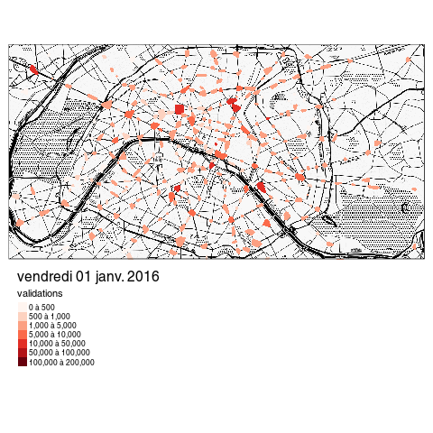

```{r setup, include=FALSE}
library(knitr)
options(htmltools.dir.version = FALSE)
opts_knit$set(cache = TRUE, fig.width=7, out.width="800px")

```


---
class: inverse, center, middle

# Commencer avec R 

https://frama.link/IAU_R

---

## Utiliser RStudio 


- présentation de l'interface
- sources d'aide

---

## Prise en main de Rstudio

- interface utilisateur
- notion de projets

---

## Trouver de l'aide avec R / Rstudio

- `?help`
- autocomplete
- google => stackoverflow / blogs / github / twitter ([#Rstats](https://twitter.com/search?vertical=default&q=%23rstats&src=typd)) / etc.
- ressources en ligne. Notamment : [r4ds](http://r4ds.had.co.nz/), [adv-r](http://adv-r.had.co.nz/), [R in action](https://www.manning.com/books/r-in-action-second-edition), [Intro à R](https://github.com/juba/intro-r), [analyse-R](http://larmarange.github.io/analyse-R/)...
- listes de diffusion et forums francophones : semin-r@mnhn.fr, fltaur@yahoogroupes.fr, r-soc@groupes.renater.fr, http://forums.cirad.fr/logiciel-R/...
- [meetups R](http://www.meetup.com/fr-FR/rparis/)... 

---
class: center, middle
# Scripter, documenter, répliquer


---
## Mon premier script R

## Mon premier notebook R

## Mon premier document Rmarkdown 


---
## Importer des données 

## En GUI ou en CLI

- bouton "Import dataset"
- en CLI : package `readr` pour le CSV, `haven` pour SPSS / SAS / Stata, `readxl` pour le XLS(X), `rio` pour (presque) tout le reste, `httr` pour APIs

---
## Importer des données

```{r tidyverse, include=FALSE}
library(tidyverse)
```


```{r import_data}
library(tidyverse)

# import d'un csv avec ';' comme séparateur de champ
# on peut passer comme premier argument une URL ou un chemin local
validations2016 <- read_csv2("./data/validations-sur-le-reseau-ferre-nombre-de-validations-par-jour-1er-sem.csv", col_types = cols(
  .default = col_character(),
  JOUR = col_date(format = ""),
  NB_VALD = col_character() # attention, c'est bien un character ("Moins de 5")
  ))

glimpse(validations2016)
```

---
class: center, middle, inverse

## Le tidyverse 

---
## La notion de tidy data
  
> “Happy families are all alike; every unhappy family is unhappy in its own way.” – Leo Tolstoy
  
> “Tidy datasets are all alike, but every messy dataset is messy in its own way.” – Hadley Wickham

---
## La notion de tidy data
  
- À chaque variable sa propre colonne
- À chaque observation sa propre ligne
- À chaque valeur sa propre cellule
  
---

## La notion de tidy data
  
.center[]

---
## La notion de tidy data
  
- Mettre chaque jeu de données dans un `tibble`
- Mettre chaque variable dans une colonne 

---
class: center, middle
# Pivoter (`gather` et `spread`)

---
## Le problème 

.center[]

---
## Le problème 

Utile parce que :

- format demandé par telle fonction/logiciel...
- (ré)agrégation de données
- nettoyage de données
- etc. etc.

---
## Pivoter un jeu de données 

- Reprendre le jeu de données "validations"
- si on veut le jeu de données au format "large" ?
- large vers long => `gather`
- long vers large => `spread`

---

```{r pivot}
valid_large <- validations2016 %>%
  mutate(validations = if_else(NB_VALD %in% "Moins de 5", 0L, as.integer(NB_VALD))) %>% 
  select(-NB_VALD) %>% 
  spread(CATEGORIE_TITRE, validations)
glimpse(valid_large)

```

---
# Filtrer (`filter`)

## Le problème 

Utile pour :

- ne sélectionner que certains cas
- enlever des cas non pertinents
- travailler sur un sous-ensemble (spatial, temporel...) du jeu de données 

---
## Filtrer un jeu de données 

- Reprendre le jeu de données "validations"
- ne conserver que les validations RATP
- ne conserver que les validations NAVIGO
- etc.

---

```{r filter}
validations2016 %>% 
  filter(CODE_STIF_TRNS %in% "100") %>% 
  glimpse
```

---

```{r filter2}
validations2016 %>% 
  filter(CATEGORIE_TITRE %in% "NAVIGO") %>% 
  glimpse
```

---

# Agréger (`group_by` + `summarise`)

## Le problème

- On veut regrouper des observations par un ou plusieurs critères 

---
## Agréger un jeu de données

- Reprendre le jeu de données "validations"
- Calculer le nombre total de validation par arrêt par jour
- Calculer le nombre moyen de validation par réseau par jour

---

```{r summarise}

validations2016 %>% 
  mutate(validations = if_else(NB_VALD %in% "Moins de 5", 0L, as.integer(NB_VALD))) %>% 
  group_by(ID_REFA_LDA) %>% 
  summarise(n = sum(validations)) %>% 
  glimpse

```

---

```{r group_mutate}

validations2016 %>% 
  mutate(validations = if_else(NB_VALD %in% "Moins de 5", 0L, as.integer(NB_VALD))) %>% 
  group_by(ID_REFA_LDA) %>% 
  mutate(p = validations / sum(validations) * 100) %>% 
  glimpse

```


---

```{r summarise2}
validations2016 %>% 
  mutate(validations = if_else(NB_VALD %in% "Moins de 5", 0L, as.integer(NB_VALD))) %>% 
  group_by(ID_REFA_LDA, JOUR) %>% 
  summarise(n = sum(validations)) %>% 
  group_by(ID_REFA_LDA) %>% 
  summarise(n = mean(n))

```

---

# Fusionner (`left_join`)

## Le problème

On veut rapprocher des données issues de deux tables différentes (dont, pour le fun, une géographique)

---

## Fusionner deux jeux de données

- Reprendre le jeu de données "validations"
- Y adjoindre le [référentiel des lieux d'arrêts](https://opendata.stif.info/explore/dataset/lda-ref-idf/information/)

---

Pour l'import et la transformation des LDA, voir [ces slides](./import_donnees_spatiales.html).

```{r join}
library(sf)
lda <- st_read("./data/LDA/lda.gpkg")

```

---

```{r join2}
lda <- lda %>% 
  mutate(ID_REFA = as.character(ID_REFA))

# validations2016 <- validations2016 %>% 
#   left_join(lda, by = c("ID_REFA_LDA" = "ID_REFA"))
# glimpse(validations2016)
# 
# alternativement

validations2016_sf <- lda %>% 
  inner_join(validations2016, by = c("ID_REFA" = "ID_REFA_LDA"))
glimpse(validations2016_sf)
```

---
# Visualiser (`ggplot2`)

## Le problème 

Avoir des données, c'est bien, les voir, c'est mieux !

---
## Visualiser des données


Couteau suisse de dataviz *statique* : [`ggplot2`](http://r4ds.had.co.nz/visualize.html)

---

```{r, message=FALSE, warning=FALSE, fig.height=4, out.width='1000px'}
validations2016 %>% 
  mutate(validations = if_else(NB_VALD %in% "Moins de 5", 0L, as.integer(NB_VALD))) %>% 
  group_by(JOUR, CATEGORIE_TITRE) %>% 
  summarise(n = sum(validations)) %>% 
  ggplot(aes(x = JOUR, y = n)) +
  geom_line(aes(color = CATEGORIE_TITRE)) +
  theme_bw()
```

---
## Extensions

http://www.ggplot2-exts.org/gallery/

---
## Une jolie viz

```{r, eval=FALSE}
library(tmap)
library(tmaptools)

valid_reduce <- validations2016 %>% 
  mutate(validations = if_else(NB_VALD %in% "Moins de 5", 0L, as.integer(NB_VALD))) %>% 
  group_by(JOUR, ID_REFA_LDA) %>% 
  summarise(validations = sum(validations))
valid_reduce_sf <- lda %>% 
  inner_join(valid_reduce, by = c("ID_REFA" = "ID_REFA_LDA"))
fonds_osm <- read_osm("Paris", type = "stamen-toner")
valid_reduce_sf <- st_transform(valid_reduce_sf, get_projection(fonds_osm))
range <- unique(valid_reduce_sf$JOUR)
for (i in as.character(range)) {
  png(paste0("validations/validations", i, ".png"))
  t <- tm_shape(fonds_osm) +
      tm_raster() +
    tm_shape(valid_reduce_sf %>% filter(JOUR %in% lubridate::ymd(i))) + 
      tm_fill(col = "validations", palette = "Reds", breaks = c(0, 500, 1000, 5000, 10000, 50000, 100000, 200000), contrast = c(0,1)) +
    tm_facets(by = "JOUR", ncol = 1, nrow = 1) +
      tm_legend(legend.outside = TRUE, legend.outside.position = "bottom", legend.format = list(text.separator = "à")) +
    tm_layout(title = lubridate::stamp_date("lundi 1 juin 1999", locale = "fr_FR")(lubridate::ymd(as.character(i))), title.snap.to.legend = TRUE)
  print(t)
  dev.off()
}
system('convert -delay 30 validations/validations*.png "animation.gif"')
system("gifsicle -b -O3 --colors 256 animation.gif")

```

---
## Une jolie viz

.image-80[]

---
## Consommer de la donnée depuis une API

- soit il existe un client R : exemple [API OpenDataSoft](https://github.com/Tutuchan/fodr)
- soit il faut appeler directement l'API grâce à [httr](https://github.com/hadley/httr)

Difficulté en général : désérialiser le JSON

---
## Consommer des données de transports publics (GTFS)

- https://github.com/ropensci/stplanr
- https://github.com/rustyb/GTFSr/blob/master/vignettes/gtfsR_how_to_use.Rmd
- https://github.com/hansthompson/gtfsnetwork

---
## Cartographier

- [leaflet](http://rstudio.github.io/leaflet/)
- [tmap](https://github.com/mtennekes/tmap)
- [cartography](https://rgeomatic.hypotheses.org/659)

.image-80[]

---
class: inverse, center, middle

# Merci !

Questions : [joel@datactivi.st](mailto:joel@datactivi.st)