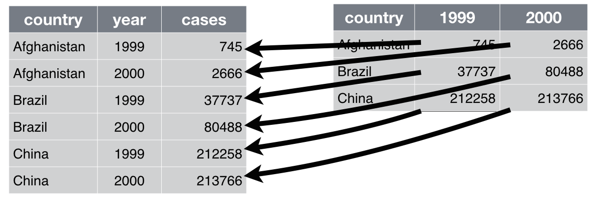

```{r setup, include=FALSE}
options(htmltools.dir.version = FALSE)
```


---
class: inverse, center, middle

# Commencer avec R 

http://datactivi.st/intro_R_IAU/atelier_R.html#1

---

## Utiliser RStudio 


- présentation de l'interface
- sources d'aide

---

## Prise en main de Rstudio

- interface utilisateur
- notion de projets

---

## Trouver de l'aide avec R / Rstudio

- `?help`
- autocomplete
- google => stackoverflow / blogs / github / twitter ([#Rstats](https://twitter.com/search?vertical=default&q=%23rstats&src=typd)) / etc.
- ressources en ligne. Notamment : [r4ds](http://r4ds.had.co.nz/), [adv-r](http://adv-r.had.co.nz/), [R in action](https://www.manning.com/books/r-in-action-second-edition), [Intro à R](https://github.com/juba/intro-r), [analyse-R](http://larmarange.github.io/analyse-R/)...
- listes de diffusion et forums francophones : semin-r@mnhn.fr, fltaur@yahoogroupes.fr, r-soc@groupes.renater.fr, http://forums.cirad.fr/logiciel-R/...
- [meetups R](http://www.meetup.com/fr-FR/rparis/)... 

---
class: center, middle
# Scripter, documenter, répliquer


---
## Mon premier script R

## Mon premier notebook R

## Mon premier document Rmarkdown 


---
## Importer des données 

## En GUI ou en CLI

- bouton "Import dataset"
- en CLI : package `readr` pour le CSV, `haven` pour SPSS / SAS / Stata, `readxl` pour le XLS(X), `rio` pour (presque) tout le reste, `httr` pour APIs

---
## Importer des données

```{r tidyverse, include=FALSE}
library(tidyverse)
```


```{r import_data}
library(tidyverse)

# import d'un csv avec ';' comme séparateur de champ
# on peut passer comme premier argument une URL ou un chemin local
validations2016 <- read_csv2("./data/validations-sur-le-reseau-ferre-nombre-de-validations-par-jour-1er-sem.csv", col_types = cols(
  .default = col_character(),
  JOUR = col_date(format = ""),
  NB_VALD = col_character() # attention, c'est bien un character ("Moins de 5")
  ))

glimpse(validations2016)
```

---
class: center, middle, inverse

## Le tidyverse 

---
## La notion de tidy data
  
> “Happy families are all alike; every unhappy family is unhappy in its own way.” – Leo Tolstoy
  
> “Tidy datasets are all alike, but every messy dataset is messy in its own way.” – Hadley Wickham

---
## La notion de tidy data
  
- À chaque variable sa propre colonne
- À chaque observation sa propre ligne
- À chaque valeur sa propre cellule
  
---

## La notion de tidy data
  
.center[]

---
## La notion de tidy data
  
- Mettre chaque jeu de données dans un `tibble`
- Mettre chaque variable dans une colonne 

---
class: center, middle
# Pivoter (`gather` et `spread`)

---
## Le problème 

.center[]

---
## Le problème 

Utile parce que :

- format demandé par telle fonction/logiciel...
- (ré)agrégation de données
- nettoyage de données
- etc. etc.

---
## Pivoter un jeu de données 

- Reprendre le jeu de données "validations"
- si on veut le jeu de données au format "large" ?
- large vers long => `gather`
- long vers large => `spread`

---

```{r pivot}
valid_large <- validations2016 %>%
  mutate(validations = if_else(NB_VALD %in% "Moins de 5", 0L, as.integer(NB_VALD))) %>% 
  select(-NB_VALD) %>% 
  spread(CATEGORIE_TITRE, validations)
glimpse(valid_large)

```

---
# Filtrer (`filter`)

## Le problème 

Utile pour :

- ne sélectionner que certains cas
- enlever des cas non pertinents
- travailler sur un sous-ensemble (spatial, temporel...) du jeu de données 

---
## Filtrer un jeu de données 

- Reprendre le jeu de données "validations"
- ne conserver que les validations RATP
- ne conserver que les validations NAVIGO
- etc.

---

```{r filter}
validations2016 %>% 
  filter(CODE_STIF_TRNS %in% "100") %>% 
  glimpse

validations2016 %>% 
  filter(CATEGORIE_TITRE %in% "NAVIGO") %>% 
  glimpse
```

---

# Agréger (`group_by` + `summarise`)

## Le problème

- On veut regrouper des observations par un ou plusieurs critères 

---
## Agréger un jeu de données

- Reprendre le jeu de données "validations"
- Calculer le nombre total de validation par arrêt par jour
- Calculer le nombre moyen de validation par réseau par jour

---

```{r summarise}

validations2016 %>% 
  mutate(validations = if_else(NB_VALD %in% "Moins de 5", 0L, as.integer(NB_VALD))) %>% 
  group_by(ID_REFA_LDA, JOUR) %>% 
  summarise(n = sum(validations))

```


---

```{r summarise2}
validations2016 %>% 
  mutate(validations = if_else(NB_VALD %in% "Moins de 5", 0L, as.integer(NB_VALD))) %>% 
  group_by(ID_REFA_LDA, JOUR) %>% 
  summarise(n = sum(validations)) %>% 
  group_by(ID_REFA_LDA) %>% 
  summarise(n = mean(n))

```

---

# Fusionner (`left_join`)

## Le problème

On veut rapprocher des données issues de deux tables différentes

---

## Fusionner deux jeux de données

- Reprendre le jeu de données "validations"
- Y adjoindre le référentiel des arrêts de transport

---

```{r join}

arrets <- read_csv2("./data/referentiel-arret-tc-idf.csv", col_types = cols(
  .default = col_character()
))

glimpse(arrets)
```

---

```{r join2}

arrets <- arrets %>% 
  separate(ZDEr_X_Y, into = c("X", "Y"), sep = ",", remove = TRUE, convert = TRUE)

validations2016 %>% 
  left_join(arrets, by = c("ID_REFA_LDA" = "LDA_ID_REF_A")) %>% 
  glimpse

```

---
# Visualiser (`ggplot2`)

## Le problème 

Avoir des données, c'est bien, les voir, c'est mieux !

---
## Visualiser des données


Couteau suisse de dataviz *statique* : [`ggplot2`](http://r4ds.had.co.nz/visualize.html)

---

```{r, message=FALSE, warning=FALSE}
validations2016 %>% 
  mutate(validations = if_else(NB_VALD %in% "Moins de 5", 0L, as.integer(NB_VALD))) %>% 
  group_by(JOUR) %>% 
  summarise(n = sum(validations)) %>% 
  ggplot(aes(x = JOUR, y = n)) +
    geom_line()
```

---
## Consommer de la donnée depuis une API

- soit il existe un client R : exemple [API OpenDataSoft](https://github.com/Tutuchan/fodr)
- soit il faut appeler directement l'API grâce à [httr](https://github.com/hadley/httr)

Difficulté en général : désérialiser le JSON

---
## Consommer des données de transports publics (GTFS)

- https://github.com/ropensci/stplanr
- https://github.com/rustyb/GTFSr/blob/master/vignettes/gtfsR_how_to_use.Rmd
- https://github.com/hansthompson/gtfsnetwork

---
## Cartographier

- [leaflet](http://rstudio.github.io/leaflet/)
- [tmap](https://github.com/mtennekes/tmap)
- [cartography](https://rgeomatic.hypotheses.org/659)

.center[]

---
class: inverse, center, middle

# Merci !

Questions : [joel@datactivi.st](mailto:joel@datactivi.st)